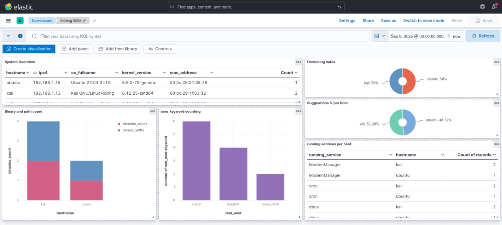

# 🔒 SOC Architecture with Lynis, Ansible & ELK

This project implements a **Security Operations Center (SOC) pipeline** for automated security auditing, compliance monitoring, and centralized log visualization.

It combines **Lynis** for auditing, **Ansible** for orchestration, and a **containerized ELK stack (Elasticsearch, Logstash, Kibana)** for data storage, parsing, and visualization.

---

## 📌 **Architecture Overview**


### Components

* **Lynis**: Security auditing & compliance tool.
* **Purple Kali**:

  * Runs Lynis remotely on target Ubuntu servers.
  * Collects and centralizes reports.
* **Ubuntu Servers (Audit Targets)**: Machines being assessed by Lynis.
* **Ansible**: Automation & orchestration of audit execution and report collection.
* **VMware**: Virtualization platform hosting Purple Kali and Ubuntu VMs.
* **Docker**: Hosts the containerized ELK stack.
* **Logstash**: Ingests and parses Lynis reports.
* **Elasticsearch**: Stores and indexes security audit results.
* **Kibana**: Provides dashboards and visualization for security insights.

---

## ⚙️ **Workflow**

1. **Audit Execution**

   * Purple Kali triggers **Lynis** scans on remote Ubuntu servers (audit targets).
   * Ansible automates the scheduling and orchestration of these scans.

2. **Report Collection**

   * Results are retrieved by Purple Kali.
   * Centralized storage of reports for further processing.

3. **Data Ingestion & Processing**

   * Reports are forwarded to **Logstash**, which parses the Lynis outputs.
   * Processed logs are sent to **Elasticsearch** for indexing.

4. **Visualization & Monitoring**

   * **Kibana** provides dashboards and security analytics for real-time monitoring.

---

## 🚀 **Features**

* Automated security audits across multiple targets.
* Centralized collection of compliance reports.
* Scalable & containerized ELK for log management.
* Clear visualization of vulnerabilities and compliance gaps.
* Supports orchestration with **Ansible** for reproducibility.

---

## 📂 **Repository Structure**

```
soc-automation/
├── ansible/
│   ├── playbooks/          # Automation workflows
│   ├── inventory/          # Host configurations
│   └── scripts/           # Maintenance utilities
├── elk-stack/
│   ├── docker-compose.yml  # ELK container setup
│   ├── logstash/config/    # Log processing rules
│   └── logs/              # Static log files (monitored by Logstash)
└── docs/
    ├── ansible-setup.md    # Ansible configuration guide
    └── elk-setup.md       # ELK stack deployment guide
```

---

## 📊 **Example Dashboard**

Kibana provides security dashboards with:

* Compliance status of all audited servers.
* Common vulnerabilities and misconfigurations.
* Historical trends of audit results.




---

## 🛠️ **How to Run**

1. **Deploy Virtual Environment**

   * Set up VMware with **Purple Kali** and Ubuntu targets.
   * Ensure Purple Kali has Docker installed.

2. **Configure Ansible**

   * Define target hosts in `inventory.ini`.
   * Run the playbooks to trigger Lynis scans.

   ```bash
   ansible-playbook run_lynis.yml
   ```

3. **Launch ELK**

   * Start containerized ELK stack:

   ```bash
   docker-compose up -d
   ```

4. **Access Dashboards**
   * Open Kibana at: [http://localhost:5601](http://localhost:5601)
   * Create index pattern: security-scans-*
   * View real-time security findings
---

## 📖 **Use Cases**

* Continuous compliance monitoring.
* Security auditing for Linux infrastructures.
* Centralized SOC visibility for multiple servers.

---

⚡ Developed as part of a **Cybersecurity SOC Automation Project** (Blue Team Focus).

---
